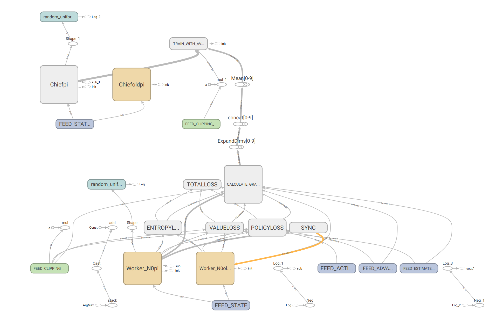

# Tensorflow-DPPO
This is a self implementation of DPPO, Distributed Proximal Policy Optimization, by using tensorflow.

Hit:
1. The loss calculation is used from OPENAI PPO.
2. The Distributed architecture design is inspired from Deepmind paper.

